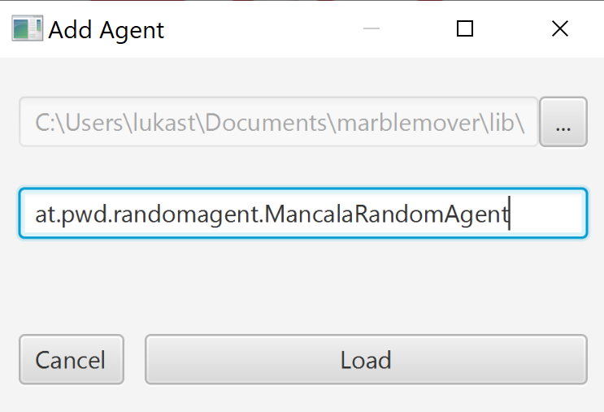

to develop a new mancala agent with visual studio code just checkout this repository 
install the JDK 8u231 from oracle and configure the JAVA_HOME System variable to point to the installed folder. (not to the bin folder but the one level before that)
then clean the config.xml so that it looks like this:

<config>
   <agents/>
   <computation-time>5</computation-time>
   <stones-per-slot>4</stones-per-slot>
   <slots-per-player>4</slots-per-player>
</config>

start the engine to load the marble mover bot

then manually add the enemy bots. 
this will change the configuration again. 
when you add the enemy JAR File 

